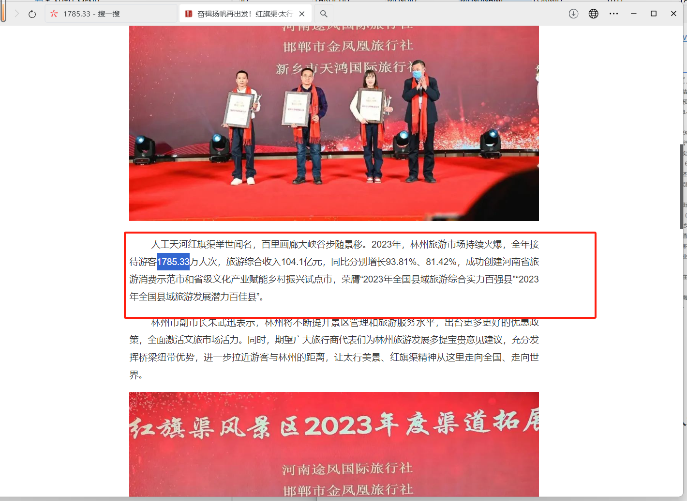
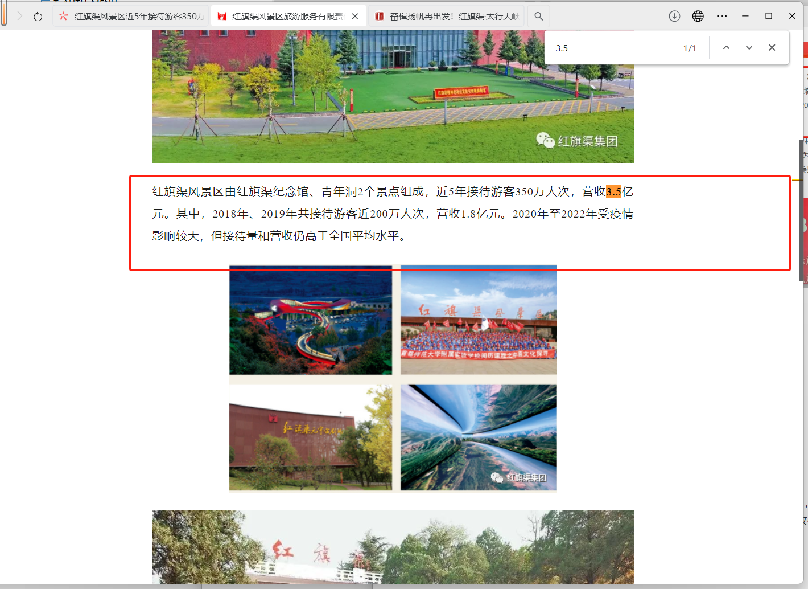
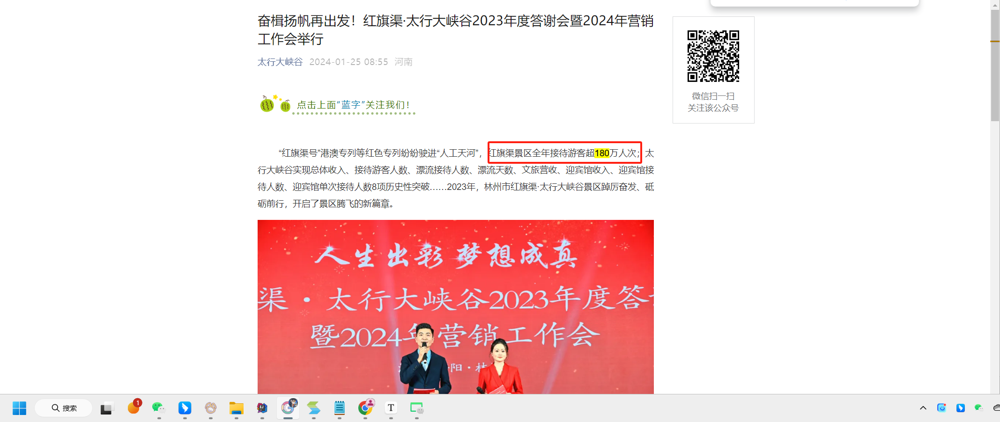

**2019年全年接待游客955.13万人次，旅游综合收入22.43亿元。**
http://www.linzhou.gov.cn/sitesources/lzsrmzf/page_pc/ywdt/zwtt/articleb27fe5926a87471dba434f7bd09f29df.html

====================================================================================

**截至2022年10月中旬，林州全市共接待游客1545.63万人次，旅游综合收入89亿元，较2019年同期分别增长了128.3%、102.6%，入选“2022中国县域旅游发展潜力百强县（市）”。**

http://www.linzhou.gov.cn/sitesources/lzsrmzf/page_pc/zwgk/fdzdgknr/zfgzbg/article84d81d7f8b2b43a2857809d465a6623f.html

====================================================================================

**2023年，林州旅游市场持续火爆，全年接待游客1785.33万人次，旅游综合收入104.1亿元，同比分别增长93.81%、81.42%。**

https://mp.weixin.qq.com/s/r4g2IuztGp0eccWoUs7a8w

======================================================================================

**红旗渠风景区近5年接待游客350万人次，营收3.5亿元。其中，2018年、2019年共接待游客近200万人次，营收1.8亿元。2020年至2022年受疫情影响较大，但接待量和营收仍高于全国平均水平。**

https://mp.weixin.qq.com/s/9Xfh1JD5GfHlzG3wn36zTA

======================================================================================

**在2023年共接待游客超180万人次**

https://mp.weixin.qq.com/s/r4g2IuztGp0eccWoUs7a8w

======================================================================================

**2023年以来，文旅消费持续复苏。“五一”假期，大峡谷景区迎来客流高峰。假期前四天，大峡谷接待游客约60000人次**

